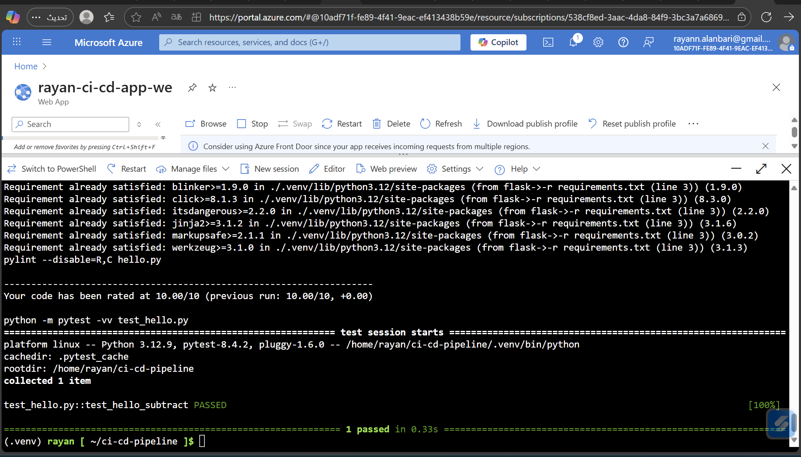
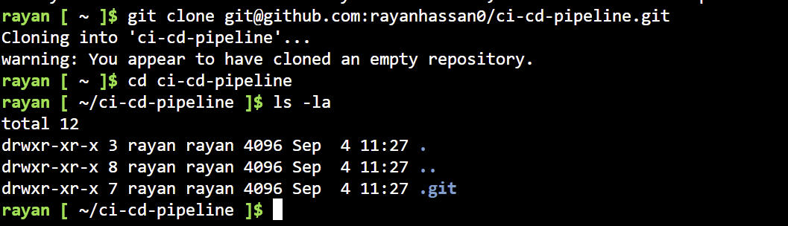

# CI/CD Pipeline Project
[](https://github.com/rayanhassan0/ci-cd-pipeline/actions/workflows/python-app.yml)

This project demonstrates a complete CI/CD pipeline using **GitHub Actions** (CI), **Azure Pipelines** (CD), and **Azure App Service** (runtime).

- **Tech:** Python + Flask + Gunicorn  
- **Endpoints:** `/` (health), `/predict` (JSON sum)  
- **Live App:** https://rayan-ci-cd-app-we.azurewebsites.net

---

## Project Overview
- **CI:** On each push/PR to `main`, GitHub Actions installs deps then runs **pylint** and **pytest**.
- **CD:** Azure Pipelines builds/archives the app and deploys to **Azure Web App** automatically.
- **Verification:** `curl` + browser after deployment.

---

## Architectural Diagram
```mermaid
flowchart LR
  A[GitHub Repo] -->|Push Code| B[GitHub Actions: CI]
  B -->|Build + Lint + Test| C[Azure Pipelines: CD]
  C -->|Deploy App| D[Azure App Service]
  D -->|Access| E[Browser / curl]
  ``` 
  ---

## How to Run (Locally / Cloud Shell)

```bash
# 1) Clone
git clone https://github.com/rayanhassan0/ci-cd-pipeline.git
cd ci-cd-pipeline

# 2) Lint & Tests (one-shot)
make all
# أو يدويًا:
# python -m pip install -r requirements.txt
# python -m pylint --disable=R,C hello.py
# python -m pytest -vv

# 3) تشغيل محلي (اختياري)
python hello.py
# افتح المتصفح على: http://127.0.0.1:8000/
```
## API Endpoints (Production on Azure)

**Health (GET `/`)**
```bash
APP="rayan-ci-cd-app-we"
curl -i "https://$APP.azurewebsites.net/"
```

## Predict (POST /predict)
```bash
APP="rayan-ci-cd-app-we"
curl -i -X POST "https://$APP.azurewebsites.net/predict" \
  -H "Content-Type: application/json" \
  -d '{"data":[1,2,3,4]}'
# => {"sum":10}
```
---

## Screenshots / Evidence

> لقطات تثبت كل الخطوات من البداية للنهاية.

**Resource Group & App Service**


**Local / Cloud Shell CI checks**



**Git & CI**



**CD on Azure Pipelines**


**Prediction JSON**


---

## Project Management

- **Trello Board:** <https://trello.com/invite/b/68bdf6f0d4f3624dcd1caa4f/ATTI793a346e5d601a2e966a8a1683ede3bcC5C83614/ci-cd-pipeline-project>  
- **Spreadsheet:** <https://docs.google.com/spreadsheets/d/195USB3uK46NjKlYLbJAeFR8yt1A4te37/edit?usp=sharing&ouid=107624253403469308209&rtpof=true&sd=true>  
- **Demo Video (YouTube):** <https://www.youtube.com/watch?v=jJ1rTz5UgLw>

